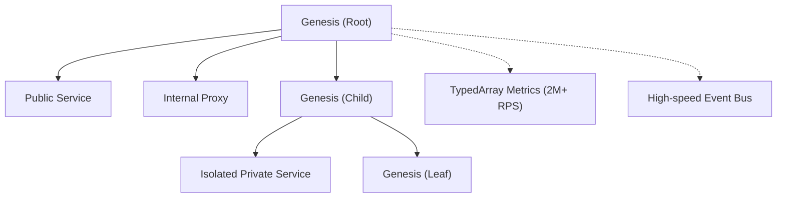

# Genesis: The Monolithic Engine

Genesis is a next-generation monolithic engine designed for high-performance systems requiring extreme throughput and absolute type safety. Optimized for modern JavaScript/TypeScript environments, Genesis provides a robust foundation for building microservices, API Gateways, or complex applications with minimal latency.

---

## Key Features

- **Superior Performance**: Achieves **2.0M+ RPS** (Requests Per Second) using a **TypedArray Metrics Engine**, enabling high-performance monitoring without pressure on the Garbage Collector (GC).
- **Zero GC Hot-path**: Engineered with memory optimization to minimize object allocation in critical paths.
- **Absolute Type Safety**: Committed to **ZERO-ANY** and **ZERO-CASTING**. The entire system leverages TypeScript's powerful inference to detect errors during development.
- **Fractal Architecture**: A Genesis system can nest multiple child Genesis instances (`use()`), creating a hierarchical service network while ensuring consistency.

---

## Architecture and Data Flow

Genesis utilizes a hierarchical structure to optimize the distribution of logic and resources.



> [!NOTE]
> In internal benchmarks (Bun 1.3.10), Genesis maintains < 0.1ms latency for each request thanks to an optimized `dispatchAtlas`.

---

## Quick Start

### 1. Initialize the Engine
```typescript
import { Genesis } from "./genesis";

const app = new Genesis("root")
  .state("config", { port: 3000 })
  .decorate("logger", (msg: string) => console.log(`[LOG] ${msg}`));
```

### 2. Define Services
Genesis supports `expose` (public), `internal` (internal within the tree), and `isolate` (private).
```typescript
const mathModule = new Genesis("math")
  .expose({
    add: async (ctx, a: number, b: number) => a + b,
    multiply: async (ctx, a: number, b: number) => a * b,
  });

app.use(mathModule);
```

### 3. Inter-module Communication
Use `request` or `connect` (Proxy) to invoke methods with automatic type inference.
```typescript
const result = await app.request("math", "add", 10, 20); // Result: 30
```

### 4. Boot and Introspection
```typescript
await app.boot();
console.log(app.info()); // View the system state snapshot
```

---

## Observability

Genesis includes a built-in **Introspection API**. By calling `app.info()`, you get a detailed map of:
- **Health Status**: `Healthy`, `Degraded`, or `Dead`.
- **Pulse Metrics**: Real-time RPS, average latency, and error rate calculated using `Float64Array`.
- **Hierarchy System**: A comprehensive list of sub-modules and active services.

---

## Development Philosophy

We believe that great software must be **fast**, **safe**, and **intuitive**.

- **Speed**: Every CPU cycle is precious. We optimize method dispatching via the `dispatchAtlas` (O(1) lookup).
- **Reliability**: No `any`. If your code builds successfully, it runs correctly.
- **Scalability**: Genesis allows you to `graft` new services into a running system without interrupting the execution flow.

---

## Installation

```bash
bun install
# or
npm install
```

---

© 2026 Synura Team. Designed for the Future.
